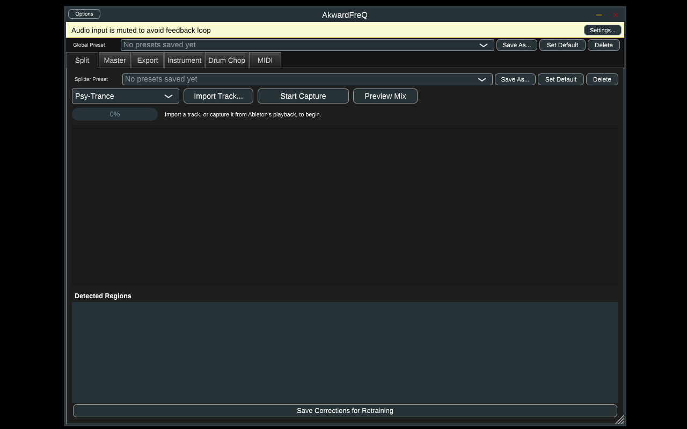
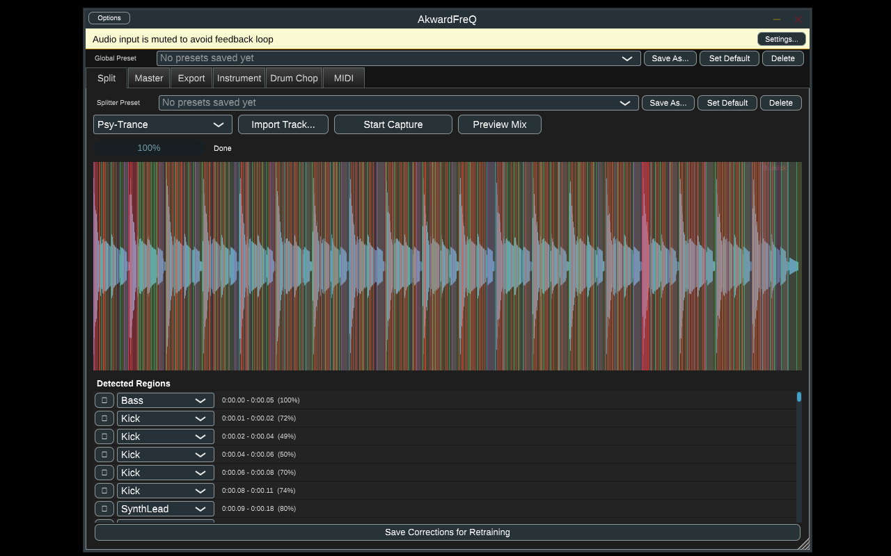
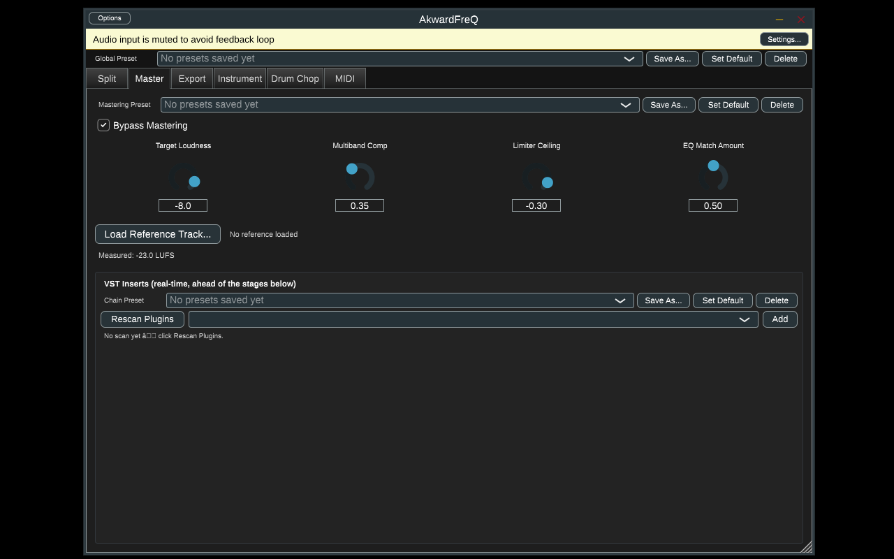
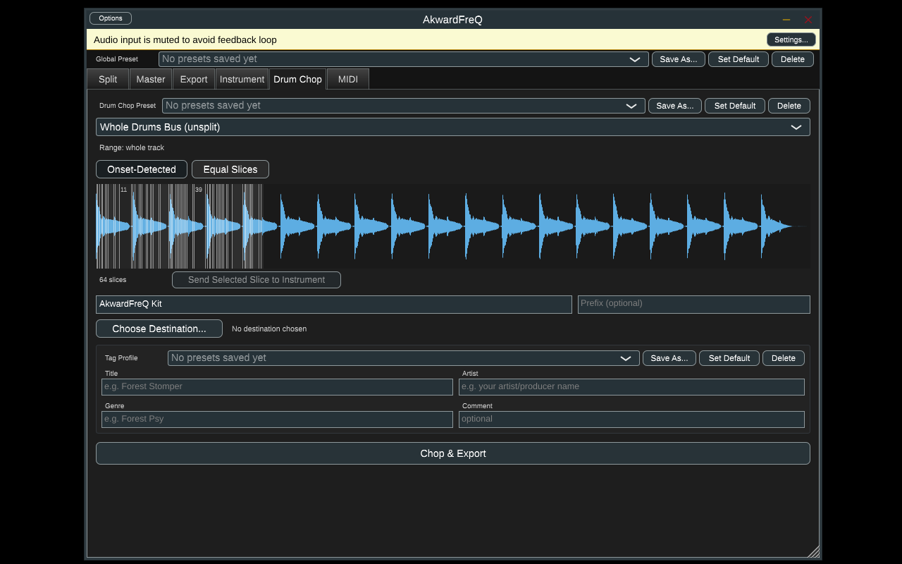

# AkwardFreQ

A VST3 plugin for Ableton (Windows) that splits a psytrance-family track into
genre-specific layers (kick, bass, hi-hats, percussion, breakbeat, synth
lead, stabs, atmospheres, fx, zaps, glitches), applies a real mastering
chain, and exports the isolated layers as a tagged sample pack — with an
in-plugin correction UI so misclassified layers can be fixed and fed back
into retraining.

## Features

- **AI stem separation** — real HT-Demucs (ONNX Runtime, CPU inference) splits
  a track into `drums` / `bass` / `other`, then DSP heuristics sub-divide
  those into 11 psytrance-specific layers: Kick, HiHat, Percussion,
  Breakbeat, Bass, SynthLead, Stabs, Atmosphere, FX, Zap, Glitch.
- **In-plugin correction + retraining loop** — reassign any misclassified
  region in the Split tab; corrections export as labeled training data, and
  `tools/retrain_layer_classifier.py` trains a small classifier on them
  offline that the plugin picks up automatically.
- **Genre-aware bias presets** (e.g. Psy-Trance) that nudge classification
  scoring toward what's actually common in that style.
- **Real mastering chain** — multiband compression, reference-track EQ
  matching, loudness trim, and limiting; not a preset dressed up as
  "mastering."
- **VST3 plugin hosting**, in two places: a real-time insert chain on the
  Master tab (ahead of AkwardFreQ's own mastering stages), and a separate
  offline batch-render chain that processes files *as they're exported* —
  something Ableton's own device chain can't do since it never touches files
  after export.
- **Drum chopping** — onset-detected or mechanical equal-N slicing of any
  stem (or the whole unsplit drums bus), with a live waveform + slice-marker
  preview, ready to drag into a Drum Rack or export as a named/prefixed
  sample folder.
- **One-shot instrument export** — SFZ (open format) and/or a best-effort
  Ableton Simpler `.adv` patch, auto-trimmed/normalized/faded from any
  selected region.
- **Audio-to-MIDI transcription** — monophonic pitch-tracking on a
  waveform-selected range, with loop-point snapping and loop preview before
  committing.
- **Tagged sample pack export** — local-only WAV metadata (RIFF INFO chunk:
  title/artist/genre/comment, plus detected BPM/key) written into every
  exported file. No network calls, ever.
- **Per-tab and global presets** — every panel (splitter, mastering, each
  VST chain, tag profile, export, instrument, drum chop) has its own
  save/set-default/delete preset library, plus one Global Preset that snapshots
  everything at once. Presets live on disk, independent of any single
  Ableton project.
- **JUCE Standalone build** alongside the VST3, so the whole plugin can be
  run and clicked through without a DAW at all — see screenshots below.

## Screenshots

These are real screenshots from an actual compiled build, run headless
(Xvfb) as a JUCE `Standalone` app — not mockups. See ["Tried it — does it
actually work?"](#tried-it--does-it-actually-work) below for how this was
validated.

| | |
|---|---|
|  Split tab, ready to import |  Real HT-Demucs separation complete — detected regions with confidence % |
|  Mastering chain + VST insert hosting |  Drum Chop — onset-detected slices with live waveform preview |

## What this actually is (read before building)

No pretrained model anywhere splits audio into 11 psytrance-specific layers —
that granularity doesn't exist as a public checkpoint. So this is a two-tier
hybrid, not a single neural net:

- **Tier A — HT-Demucs (pretrained, inference only)**: splits the mix into
  `drums` / `bass` / `other` stems. This part is genuinely reliable.
- **Tier B/C — DSP heuristics**: onset detection, spectral/envelope feature
  extraction, and rule-based scoring sub-divide the `drums` bus into
  Kick/HiHat/Percussion/Breakbeat and the `other` bus into
  SynthLead/Stabs/Atmosphere/FX/Zap/Glitch. These are acoustic-behavior
  heuristics, not genre knowledge — stabs/zaps/glitches/fx in particular
  overlap acoustically and *will* be misclassified sometimes. That's expected,
  not a bug to chase.
- **Tier D — your corrections**: the Split tab's region list lets you
  reassign any layer; `TrainingDataExporter` saves your corrected
  feature+label pairs, and `tools/retrain_layer_classifier.py` trains a small
  classifier on them, offline, on your own machine. Drop the resulting
  `Models/UserTrained/layer_classifier.onnx` in and the plugin uses it in
  place of the built-in heuristics automatically.

Mastering (multiband compression, reference-track EQ matching, loudness trim,
limiting) is real DSP, not ML. Sample pack export slices actual audio out of
the isolated layers — it is **not** generative sample synthesis; it can't
invent new sounds, only tag and organize what's already in your imported
tracks.

See `docs/FEATURE_SPEC.md` for the exact feature vector contract shared
between the C++ classifier and the Python retraining script.

### One-shot instruments, drum chopping, and MIDI (Instrument / Drum Chop / MIDI tabs)

- **Instrument tab**: exports whatever region is currently selected in the
  Split tab as a standalone one-shot — SFZ (open format, works in Kontakt via
  its SFZ importer, Decent Sampler, sforzando, etc.) and/or an Ableton
  Simpler preset (`.adv`). Native Instruments' own `.nki` format is encrypted
  and undocumented — there's no legitimate way to write one, which is why SFZ
  is the primary format here rather than a Kontakt-native file. Before either
  format is written, `OneShotCleaner` trims dead air from the edges (keeping
  a small pre-roll before the detected onset so the attack stays intact),
  normalizes peak level, and applies short fades so the file has no
  boundary clicks regardless of how precisely the region was drawn — this is
  the "cleaned up" one-shot, not any kind of resynthesis.
- **Drum Chop tab**: chops any stem (or the whole unsplit `drums` bus) into
  slices and exports them as named, prefixed `.wav` files, ready to drag into
  an Ableton Drum Rack yourself. There's no one-click `.adg` Drum Rack
  generator — see "Ableton preset export" below for why. Two slicing modes:
  **Onset-Detected** (follows transients, the original behavior) or **Equal
  Slices** (mechanically divides the range into exactly N pieces via a single
  "Slices" knob, 1–64) — useful on material with weak transients, or when you
  just want even N-way chops regardless of what's actually in the audio. A
  live waveform with slice markers (`SliceMarkerView`) redraws as you change
  mode/knob/layer/range, ReCycle/SliceX/Renoise-style — this is a genuine
  visual preview, not just a knob and a hope: click a marker to select that
  slice, then either export the whole batch or send just that one slice
  straight to the Instrument tab as a one-shot.
- **MIDI tab**: pick a range on the Split tab's waveform (toggle "Pick Range
  on Waveform"), optionally snap it to a clean 2/4/8/16-bar loop, use "Loop
  Preview" to hear it repeat before committing, then transcribe it to a
  Standard MIDI File. Transcription is monophonic pitch-tracking — genuinely
  useful on a synth lead or bass layer, but it will **not** produce a real
  chord transcription from a stab or atmosphere layer (it'll output one
  wandering note per onset instead). Pick a monophonic layer as the source.

#### Ableton preset export (`.adv` Simpler) is best-effort

Ableton's `.adv`/`.adg` format is undocumented, gzip-compressed XML.
`AbletonPresetWriter` doesn't generate this from scratch (too easy to get
subtly wrong and produce a file Ableton silently refuses to load) — it
*patches* a real preset you export from Ableton once. See
`Models/Templates/README.md` for the one-time setup. Without a template,
Simpler export fails with a clear error; SFZ and folder export always work
regardless. Drum Rack (`.adg`) export isn't implemented at all yet for the
same reason, at a scale where guessing wrong is more likely — folder export
of chopped hits is the reliable path there.

### Tagging exports (Export / Instrument / Drum Chop tabs)

Every export tab has a small tag panel — title/artist/genre/comment fields,
plus AkwardFreQ's own detected BPM/key shown read-only and included
automatically. Fill in what you want and it's written into every `.wav` that
export writes.

This is **local tagging only, by design** — no network calls, no API key,
nothing leaves your machine. We looked at MusicBrainz/AcoustID (Chromaprint
fingerprinting against their free database, which could auto-identify a
source track and prefill tags from it) but that requires reaching out to a
third-party service on every export, which isn't something a plugin should
do without being asked; it's a reasonable feature to add later behind an
explicit opt-in, not something scoped into this pass.

It's also worth being precise about what "tagging a WAV" actually means:
**true ID3v2 is an MP3-native spec** and doesn't apply to WAV files at all.
The practical WAV equivalent — what this feature actually writes — is the
**RIFF INFO chunk**, WAV's own standard tagging mechanism (`INAM`/`IART`/
`IGNR`/`ICMT`/`ISFT` for title/artist/genre/comment/software), which is what
Ableton's own sample browser and most other DAWs/players read. BPM and key
get folded into the comment field (`ICMT`) as plain text, since `ICMT` is
universally recognized — key is *also* written as `IKEY`, but that FourCC
isn't part of the guaranteed-standard RIFF INFO set, so the comment field is
the fallback that's certain to show up somewhere.

### Hosting your own VST3 plugins (Mastering and Export tabs)

AkwardFreQ can load VST3 plugins you already have installed and run them in
two different places:

- **Mastering tab — "VST Inserts"**: a real-time chain that processes audio
  *before* AkwardFreQ's own multiband comp/EQ-match/limiter stages. Add
  plugins from your installed VST3s, reorder/bypass/remove them, and open
  each one's own editor window to tweak it — same idea as Blue Cat's
  PatchWork or any other "plugin chainer," just built into this plugin
  directly rather than needing a separate host.
- **Export tab — "Batch-Render VST Chain"**: a *separate*, offline-only
  chain. Turn on "Batch-render through VST chain before exporting" and every
  file written by Sample Pack / Instrument / Drum Chop export gets rendered
  through it first (block-by-block, with tail extension for reverbs/delays
  capped at 2s). This is the one Ableton's own device chain genuinely can't
  do for you — Ableton never touches your files after they're exported, so
  there's no way to "just insert a plugin on the track" to get the same
  result.

Both chains share a plugin picker: click **Rescan Plugins** once (scans the
standard VST3 install folders and caches the results — subsequent launches
reuse the cache), then pick a plugin and click **Add**. Loaded plugins,
their bypass state, and their internal parameter state are saved with your
Ableton project and restored on reload.

**Scope and real caveats, stated plainly:**
- **VST3 only.** VST2's SDK was discontinued by Steinberg years ago and
  isn't cleanly redistributable any more; VST3 is what JUCE hosts natively
  and what most current plugins ship as anyway.
- **No crash isolation.** A misbehaving third-party plugin can take down
  AkwardFreQ — and potentially the whole Ableton session — with it. This is
  inherent to hosting plugins in-process (the same tradeoff every JUCE-based
  plugin-chainer makes); true sandboxing would need each plugin running in
  its own separate process, which is a much larger undertaking than what's
  built here.
- **Not real-time-safety-audited beyond AkwardFreQ's own code.** Once a
  hosted plugin's `processBlock` is called, whether it behaves in a
  real-time-safe way (no locks, no allocation) is up to that plugin, same as
  in any other host.
- **Restoring a saved chain reloads plugins one at a time, in order**, so
  saved ordering is preserved even though plugin instantiation is
  asynchronous and load times vary per plugin — but it does mean a project
  with several heavy plugins in one chain can take a few seconds to finish
  reloading them all after you reopen it.

See `Source/vsthost/` for the hosting implementation.

### Presets — saving your setup, and making it the default

Every tab has its own small preset dropdown ("Splitter Preset", "Mastering
Preset", "Chain Preset" on each VST chain, "Tag Profile", "Export Preset",
"Instrument Preset", "Drum Chop Preset"), plus one "Global Preset" dropdown
above the tabs that saves/recalls everything at once. Each one works the
same way: **Save As...** names and stores the current settings, **Set
Default** marks whichever preset is selected as the one to auto-load next
time, and **Delete** removes it.

This exists because re-entering the same setup on every project gets old
fast — the concrete example that prompted it: type your artist name into
**Tag Profile** once, hit Set Default, and it's pre-filled on every export
tab from then on, in every project, without touching it again.

A few things worth knowing about how this is scoped:

- **Presets live outside your project, on disk** — under
  `<user application data>/AkwardFreQ/Presets/<category>/`, one `.xml` file
  per saved preset, plus a `_default.txt` marking which one auto-loads. This
  is deliberate: the whole point of "make it default" is that it survives
  across every Ableton project and every session, not just the one you saved
  it from. Nothing here is written into your Ableton project file — that
  still only stores your actual current settings (via the plugin's normal
  state save/restore), same as before this feature existed.
- **VST chains are their own shared preset library** ("Chain Preset",
  category `VstChain`), independent of which tab's chain panel you're
  looking at. Build a chain for full-mix mastering and another for
  bass-focused processing, save both by name, and recall either one into
  *either* the Mastering insert chain or the Export batch-render chain —
  they're the same dropdown in both places on purpose.
- **Tag Profile** (category `TagProfile`) is likewise one shared library
  across the Export, Instrument, and Drum Chop tabs — save your artist name
  once, not three times.
- **The Global preset bundles everything's current settings into one
  snapshot** (genre, mastering knobs, both VST chains, export/instrument/
  drum-chop defaults) but doesn't touch the per-tab preset libraries
  themselves — recalling a Global preset restores all those settings at
  once; it doesn't overwrite your saved "Chain Preset" or "Tag Profile"
  entries. Tag Profile fields aren't included in the Global snapshot at
  all, since that's already covered by its own default mechanism.

See `Source/presets/PresetManager.h` for the on-disk format and
`Source/ui/PresetBar.h` for the reusable dropdown UI.

## Building (Windows)

This was developed without a Windows machine or Ableton available to test
against, so treat the first build as the real integration test — file an
issue / fix forward if CMake or JUCE's API has moved since.

### Prerequisites

- Visual Studio 2022 (Desktop development with C++ workload)
- CMake ≥ 3.22 (Visual Studio's bundled CMake works)
- Git
- Python 3.10+ (for the offline model-export tooling, not for the plugin build)

### 1. Get ONNX Runtime

Download a prebuilt Windows release from
https://github.com/microsoft/onnxruntime/releases — grab the
`onnxruntime-win-x64-<version>.zip` asset (CPU build is fine) and extract it
somewhere, e.g. `C:\onnxruntime`.

### 2. Export the Demucs model

```
cd tools
pip install -r requirements.txt
python export_demucs_onnx.py --output ../Models/htdemucs.onnx
```

This downloads Meta's pretrained HT-Demucs weights (~100MB) and converts them
to `Models/htdemucs.onnx`. Without this file the plugin builds and loads
fine, but stem separation reports "Demucs model not found."

HT-Demucs's own forward pass isn't directly ONNX-exportable — it computes a
genuine complex-dtype STFT/ISTFT internally (`torch.stft(...,
return_complex=True)`, `torch.view_as_complex`/`view_as_real`), none of
which PyTorch's ONNX exporter supports as of torch 2.13, at any opset.
`tools/_stft_onnx_patch.py` (applied automatically by the export script)
replaces those internals with a real-tensor-only reimplementation — Conv1d
for the forward transform, Fold-based overlap-add for the inverse — verified
numerically against the unpatched model (`tools/verify_stft_patch.py`,
max diff ~4e-5 on real HT-Demucs weights) before ever trusting an export
built from it. This was confirmed by actually exporting and running the
real model end-to-end (see "Tried it — does it actually work?" below), not
just by inspection.

### 3. Configure and build

```
cmake -B build -DONNXRUNTIME_ROOT_DIR="C:/onnxruntime"
cmake --build build --config Release
```

The first configure fetches JUCE from GitHub (via `FetchContent`) — expect it
to take a few minutes.

With `COPY_PLUGIN_AFTER_BUILD` on (default in `CMakeLists.txt`), JUCE copies
the built `.vst3` into your system's VST3 folder
(`%COMMONPROGRAMFILES%\VST3`) automatically. Copy `Models/htdemucs.onnx` (and
`Models/UserTrained/layer_classifier.onnx` if you have one) into that same
`AkwardFreQ.vst3` folder's `Contents/x86_64-win` directory alongside the
plugin binary — that's where `PluginProcessor::getModelsDirectory()` looks
(next to `juce::File::currentExecutableFile`).

Rescan plugins in Ableton (Preferences → Plug-ins → Rescan) and AkwardFreQ
should show up under VST3.

### Known limitation: MP3 import

JUCE's bundled `AudioFormatManager::registerBasicFormats()` covers WAV, AIFF,
FLAC, and OGG — it does not include an MP3 *decoder* (JUCE only ships an MP3
encoder in some paid tiers). Importing an `.mp3` via the Split tab's "Import
Track" will fail with a clear error; convert to WAV first, or capture the
track live from Ableton's transport instead (the "Start Capture" button),
which works regardless of source format since it just records the plugin's
live audio input.

### Tried it — does it actually work?

Yes, genuinely — this was actually built and run, not just reviewed. The
whole pipeline was validated end-to-end on Linux (the code targets Windows,
but the plugin/JUCE/CMake layer is cross-platform, and Linux was what was
available for this check): a real `Standalone` JUCE build (see `FORMATS` in
`CMakeLists.txt` — added specifically so the plugin can be run and clicked
through without needing a DAW host at all), a real `htdemucs.onnx` exported
via `tools/export_demucs_onnx.py`, and a real ONNX Runtime — loaded, run
under a headless X server, driven through the actual UI (import a track →
watch real HT-Demucs separation run → see real detected regions → open the
Drum Chop tab and see `SliceMarkerView` render real onset-detected slices
from the real separated audio). This surfaced and fixed several real bugs
that only show up on an actual compile (this codebase had never been built
before): a couple of missing includes, an ambiguous `int64_t`→`juce::var`
conversion, duplicate `mixToMono` definitions left over from before it was
promoted to a shared utility, JUCE `dsp::ProcessContextReplacing` binding to
a temporary `AudioBlock` instead of a named one, and a nested-struct
default-argument pattern (`const Settings& = {}`) that GCC and Clang both
reject when the struct is declared inside the same class as the function —
fixed with an overload instead, with identical call-site ergonomics. All of
that is fixed in this repo now, not just identified.

A real Windows `.vst3` and `.exe` (the actual VST3 target, and its
Standalone counterpart) have also been produced directly from this Linux
container, by cross-compiling with mingw-w64 (`toolchain-mingw64.cmake`) —
confirmed as genuine `PE32+` Windows binaries (`file` reports
`PE32+ executable (DLL)` / `PE32+ executable (GUI)`), not just a clean
configure. Getting there required two real fixes, both scoped to mingw only
so a normal MSVC build is untouched:

- ONNX Runtime's C API headers assume MSVC: `ORT_API_CALL` expands to the
  single-underscore `_stdcall` (mingw only recognizes `__stdcall`), and they
  pull in SAL annotation macros (`_Frees_ptr_opt_` etc.) that mingw-w64's own
  `sal.h` doesn't fully define. Both are shimmed in
  `Source/separation/OnnxMingwShim.h`, included before the ONNX Runtime
  headers in `DemucsEngine.cpp`/`LayerClassifier.cpp`.
- JUCE's VST3 manifest helper (`juce_vst3_helper`) is itself cross-compiled
  to a Windows `.exe`, which can't execute on the Linux host to generate the
  optional `moduleinfo.json` scan-acceleration manifest during the build —
  that step fails, but the actual plugin binary links and completes
  regardless; `moduleinfo.json` is a VST3 SDK 3.7+ convenience for faster
  host scanning, not required for a host to load the module. Running the
  build under Wine, or on a real Windows/MSVC toolchain, would generate it.

A third, environment-level issue (not fixable from repo code) shows up on
Linux specifically because its filesystem is case-sensitive: part of the
VST3 SDK includes `<Windows.h>` (capital W), but mingw-w64 only ships
`windows.h` (lowercase), so it fails to find it. Fixed for this container by
adding a same-directory symlink —
`ln -s windows.h /usr/x86_64-w64-mingw32/include/Windows.h` — before
building; anyone reproducing this cross-build path on their own Linux box
will need the same one-time symlink.

This cross-build path is a convenience for CI/dev containers without a
Windows machine — `Visual Studio + the steps above` remains the reliable,
fully-supported way to produce a release build.

## Project layout

```
Source/
  PluginProcessor.*        JUCE AudioProcessor: capture/import, orchestrates
                            SeparationEngine + MasteringChain, real-time safe
                            processBlock (preview mix + mastering only —
                            separation always runs on a background thread)
  PluginEditor.*            Split / Master / Export / Instrument / Drum Chop / MIDI tabs
  separation/
    DemucsEngine.*           Tier A — ONNX Runtime inference, chunked overlap-add
    AnalysisUtils.*          onset detection, spectral/pitch features (docs/FEATURE_SPEC.md)
    LayerClassifier.*        Tier B/C/D scoring — rule-based, or a loaded user ONNX model
    DrumSubSplitter.*        Tier B — kick/hihat/percussion/breakbeat
    OtherSubSplitter.*       Tier C — synth lead/stabs/atmosphere/fx/zap/glitch
    GenreBias.*              per-genre-preset score nudging
    LayerRenderer.*          mask-based isolated-layer audio reconstruction
    SeparationEngine.*       orchestrates A -> B/C -> D on a background thread
    TrainingDataExporter.*   writes corrected regions for offline retraining
    DrumSlicer.*             onset-based chopping of a drum buffer/range into hits
    EqualSlicer.*            mechanical N-equal-slice chopping (the "Slices" knob mode)
  mastering/
    LoudnessMeter.*          approximate BS.1770-style loudness measurement
    MasteringChain.*         multiband comp, reference EQ match, limiter
  export/
    SamplePackExporter.*     slices tagged regions into a folder-organized .wav pack
    WavFileWriter.*          shared "write this sample range as .wav" helper
    OneShotCleaner.*         trim/normalize/fade a one-shot before instrument export
    SfzExporter.*            one-shot -> SFZ instrument (open format)
    AbletonPresetWriter.*    one-shot -> Ableton Simpler .adv (best-effort, patches a template)
    DrumRackExporter.*       chopped drum hits -> named/prefixed .wav folder
  midi/
    AudioToMidiConverter.*   monophonic pitch-tracking transcription -> Standard MIDI File
    LoopSnapper.*            bar-grid + waveform-continuity loop point search
  vsthost/
    PluginScanner.*          finds + caches installed VST3 plugins
    HostedPluginSlot.*        one loaded plugin: process, bypass, editor window, state
    PluginChain.*            thread-safe ordered list of hosted plugins
    PluginWindow.*           DocumentWindow wrapper for a hosted plugin's editor
    BatchVstRenderer.*       offline block-wise render through a PluginChain (export-time)
  ui/                        WaveformRegionView, RegionListPanel (correction UI),
                              MasteringPanel, ExportPanel, InstrumentExportPanel,
                              DrumRackPanel, MidiPanel, PluginChainPanel (shared VST-chain UI)
tools/                       offline Python — model export + retraining (not built into the plugin)
docs/FEATURE_SPEC.md         C++ <-> Python feature vector contract
Models/                      .onnx files go here (gitignored — see Models/README.md)
Models/Templates/            Ableton preset templates for AbletonPresetWriter (see its README)
```
